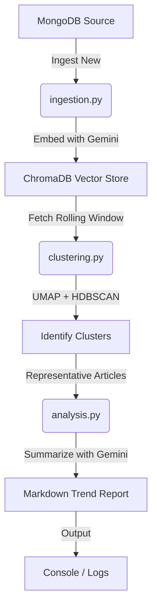

# 🧬 Research Agent — Trend Detection Pipeline

A robust, automated research agent that converts raw news data into actionable insights. This pipeline fetches articles from **MongoDB**, clusters them using **UMAP** and **HDBSCAN**, identifies emerging clusters, and generates AI-driven trend summaries using **Google Gemini**.

---

## 🚀 Overview

The **Research Agent** is designed to run in the background, performing a full analysis cycle every 24 hours. It ensures that your context window is always up-to-date with the latest information while maintaining a rolling 24-hour history for consistent trend tracking.

### 🔄 The Workflow


---

## ✨ Key Features

-   **⏱️ Automated Scheduling:** Built-in scheduler (APScheduler) runs the pipeline every 24 hours.
-   **📥 Smart Ingestion:** Incrementally fetches only *new* articles from MongoDB since the last successful run.
-   **🖼️ Vector Search:** Uses `chromadb` for efficient storage and retrieval of high-dimensional embeddings.
-   **🧩 Dynamic Clustering:** Employs UMAP for dimensionality reduction and HDBSCAN for density-based clustering to handle noise and varying cluster shapes.
-   **🤖 LLM-Powered Analysis:** Leverages Gemini (Gemini 2.5 Flash) to generate structured summaries for each identified trend.
-   **🪵 Robust Logging:** Detailed logs with execution timestamps and pipeline status.

---

## 🛠️ Tech Stack

-   **Language:** Python 3.12+
-   **Database:** [MongoDB](https://www.mongodb.com/) (Document store), [ChromaDB](https://www.trychroma.com/) (Vector store)
-   **AI Infrastructure:** [Google AI SDK (Gemini)](https://ai.google.dev/)
-   **Machine Learning:** `scikit-learn`, `umap-learn`, `hdbscan`, `numpy`, `pandas`
-   **Validation:** `pydantic`
-   **Orchestration:** `apscheduler`

---

## 🏁 Getting Started

### 1. Prerequisites

-   **Python 3.12+**
-   **MongoDB Cluster** (e.g., MongoDB Atlas)
-   **ChromaDB Server** (Running locally on port 8000)
-   **Google Gemini API Key**

### 2. Installation

Clone the repository and install dependencies using [uv](https://github.com/astral-sh/uv):

```powershell
# Install dependencies
uv sync

# Or using pip
pip install -r requirement.txt
```

### 3. Configuration

Create a `.env` file in the root directory:

```env
GEMINI_API_KEY=your_gemini_api_key_here
DB_URI=your_mongodb_uri
```


### 4. Running the Pipeline

To start the automated scheduler:

```powershell
python main.py
```

Upon startup, the agent will:
1.  Perform an immediate baseline run.
2.  Start a background scheduler that triggers every 24 hours.

---

## 📂 Project Structure

```text
research_agent/
├── main.py          # Entry point — Orchestrates the pipeline & scheduler
├── config.py        # Central configuration, clients, and constants
├── ingestion.py     # MongoDB ingestion logic
├── clustering.py    # UMAP & HDBSCAN clustering logic
├── analysis.py      # LLM summarization & trend extraction
├── models.py        # Pydantic schemas for data validation
├── requirement.txt  # Project dependencies
└── .env             # Environment variables (API Keys)
```

---

## 🧠 Methodology

### Rolling Window
The agent maintains a **24-hour rolling window** of news data. This ensures that the trends generated are current and relevant while preventing older, stale data from skewing the results.

### Clustering Strategy
-   **Embeddings:** Text is converted to 768-dimensional vectors using `gemini-embedding-001`.
-   **UMAP:** Reduces dimensionality to improve clustering performance and stability.
-   **HDBSCAN:** Groups related articles into clusters while automatically identifying "noise" articles that don't fit any particular trend.

### Summarization
For each cluster:
1.  We identify the **top 3 representative articles** based on centroid proximity.
2.  The content is passed to Gemini with a specialized prompt to extract a **Label**, **Core Topic**, and a **Concise Summary**.

---
## 👋 About Me

For inquiries or collaborations, feel free to reach out at: [ducanh4012006@gmail.com](mailto:ducanh4012006@gmail.com)

